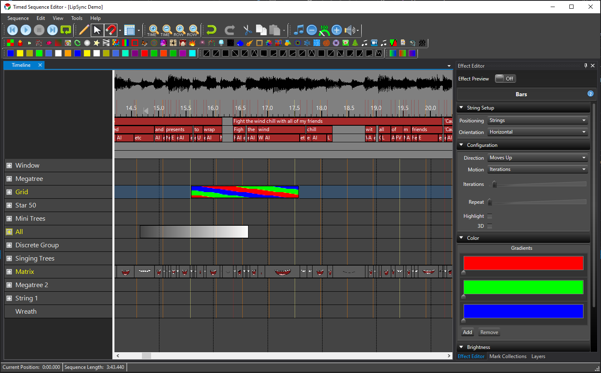

Vixen is a full featured sequencer for producing animated light shows. It provides all the software tools necessary to create and run an animated light show sequenced to music. It supports typical DIY controllers as well as DMX, traditional and pixel lighting. It runs on the Windows platform under the .Net Framework.

## Installation
You can download and install Vixen via the self contained installer:

[Download Vixen 3](http://www.vixenlights.com/downloads/vixen-3-downloads/)

[Latest Release Notes](https://github.com/VixenLights/Vixen/blob/master/Release%20Notes.txt)

#### Bugs / Feature requests

[Bug Tracker](https://bugs.vixenlights.com)

## License

Vixen 3 is unlicensed and free to use.  
[License](https://github.com/VixenLights/Vixen/blob/master/License.txt)

#### WARRANTY DISCLAIMER

This software is provided 'as-is', without any express or implied warranty. 

#### Source Code

Vixen 3 is Open Source and source code is available on GitHub at https://github.com/VixenLights/Vixen/ under the licensing outlined above. 
#### Developer Info

This repository contains all the public source available for to build the Vixen 3 system. 

Vixen 3 is a modular application that allows for pluggable modules to be developed for it. It is written in C# and some small parts in C++. The code structure is as follows: 

* /Common - Common components used by the application and modules
* /Modules - Modules developed and maintained by the core team, and other contributors
* /Application - The main Vixen application
* /Vixen.System - The Vixen core framework 
* /Installer - Files to build the installer using NSIS

The current solution utilizes Visual Studio 2019, C++ build tools 142, .NET Framework 4.8

You should be able to open the Vixen.sln solution and have it 'magically work'. If you have any problems, please let us know.

Conventions for development:

- The assembly name should be the name of the module (eg. TimedSequenceEditor), and
  the default namespace should be "VixenModules.<ModuleType>.<ModuleName>". For
  example, VixenModules.Editor.TimedSequenceEditor.
 
  
- The build output directory should be relative to the solution directory, in an
  'Release' directory for x86 release builds, and a 'Release64' directory for x64 release builds. The Debug output folders follow the same pattern
  It will also depend on the type of module. For example:
  
  Vixen Modules (Release):              $(SolutionDir)\Release\Modules\<ModuleType>\
  Vixen Modules (Release64):            $(SolutionDir)\Release64\Modules\<ModuleType>\
  Vixen Common assemblies (Release):    $(SolutionDir)\Release\Common\
  Vixen Common assemblies (Release64):  $(SolutionDir)\Release64\Common\
  Vixen Applications (Release):         $(SolutionDir)\Release\
  Vixen Applications (Release64):       $(SolutionDir)\Release64\

  Note: the $(SolutionDir) text will need to be edited in the .csproj file directly as VS escapes the '$()' macros. The csproj files follow the current SDK style format.

  If you're unsure, look at another existing project, and copy the OutputPath for both
  Release and Release64, eg.:
  <OutputPath>$(SolutionDir)\Release\Modules\Controller\</OutputPath>
  <OutputPath>$(SolutionDir)\Release64\Modules\Controller\</OutputPath>
  
 
- To reference the Vixen project (or any other projects that are needed), make sure you
  add a 'project reference', and not a "normal" reference (to the binary DLL). This will help compatibility for other developers when used in different locations. References to projects should be set so they do not copy local. This avoids assembly loader issues with multiple copies. Under Properties of the reference.
  
  * Copy Local : No
  * Include Assets: None

- NuGet packages follow the same principle as Project References. You should include the package in the Common area and allow the libraries to be deployed in that path. Then in the local project the NuGet package is added but is set not to copy the assets locally by setting the following in the properties of the library.

    * Exclude Assets : None
      
- Tabs vs. Spaces, and other formatting: Tabs are preferred, and general formatting standards are followed. However, please try to review all your own changes before committing, to ensure you are not making large changes to unrelated sections of code (eg. changing formatting in a file, or whitespace, etc.). Commits like this may be rejected. If larger reformats are desired, include them in their own commits noted as such to distingush them from logic changes. 

